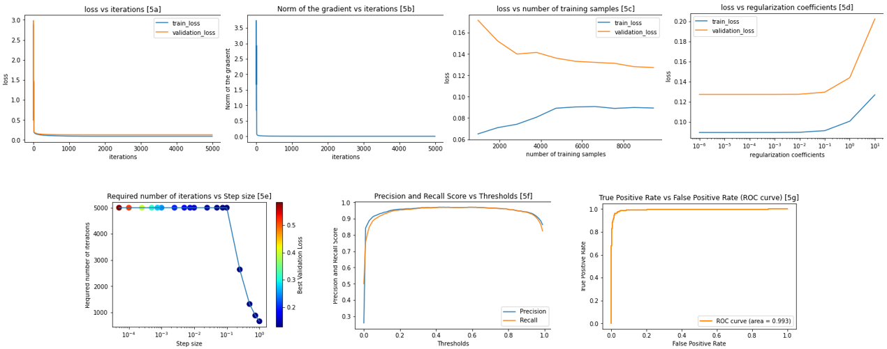

# BUET-EEE_6002-PPML-Assignments
This repository contains the code files and reports for the assignments for EEE 6002 Privacy-Preserving Machine Learning Course conducted in the April 2020 semester.

# Logistic Regression
The code for Logistic Regression has been implemented from scratch. Suppose the coefficients are ω, input features are X, ground truth is y, regularization coefficient is λ, m is the total number of data, n is number of coefficients, r is the feature dimension and α is the step size. The algorithm for vanilla logistic regression is:

<a href="https://www.codecogs.com/eqnedit.php?latex=\begin{align*}&space;&&space;logits,&space;f(x)&space;=&space;\omega&space;X&space;=&space;\omega_{1}x_{0}&plus;\omega_{2}x_{1}&plus;\omega_{3}x_{2}&plus;\omega_{4}x_{3}&plus;.....&plus;\omega_{n}x_{r}&space;\\&space;&&space;sigmoid&space;\&space;function,&space;\&space;\sigma(z)=\frac{1}{1&plus;\exp(-z)}&space;\\&space;&&space;hypothesis,&space;\&space;\hat{y}(\omega,&space;X)=\sigma(\omega&space;X)&space;\\&space;&&space;loss,&space;\&space;L(y,\hat{y},\omega)&space;=&space;-\bigm[\frac{1}{m}\sum_{i=1}^{m}(y_{i}\log(\hat{y}_{i})&plus;(1-y_{i})\log(1-\hat{y}_{i}))&space;-&space;\frac{\lambda}{2m}\sum_{i=1}^{n}||\omega_{i}||^2_2&space;\bigm]&space;\\&space;&&space;gradient,&space;\&space;\triangledown_{\omega}L&space;=&space;\frac{1}{m}(X^{T}(\hat{y}-y)&plus;\lambda\omega)&space;\\&space;&&space;weight&space;\&space;update,&space;\&space;\omega&space;=&space;\omega&space;-&space;\alpha\triangledown_{\omega}L&space;%\\&space;\end{align*}" target="_blank"></a>

Here, ω1 is the bias term and we will assume x0 is 1. In the case of the Gaussian or Laplacian differential privacy mechanism, the only change will occur in the gradient phase. We will add a noise term with the gradient before updating the weight values. For the Gaussian mechanism, the data will be norm-2 normalized. The updated steps are:

<a href="https://www.codecogs.com/eqnedit.php?latex=\begin{align*}&space;&&space;sensitivity,&space;\&space;\Delta_{f}=\frac{2}{m}&space;\\&space;&&space;gaussian&space;\&space;noise,&space;n_{g}&space;=&space;N(0,&space;\frac{2\Delta_{f}^{2}}{\epsilon^{2}}\log(1.25/\delta))&space;\\&space;&&space;new&space;\&space;gradient,&space;\&space;(\triangledown_{\omega}L)_{new}&space;=&space;\triangledown_{\omega}L&space;&plus;&space;n_{g}&space;\\&space;&&space;weight&space;\&space;update,&space;\&space;\omega&space;=&space;\omega&space;-&space;\alpha(\triangledown_{\omega}L)_{new}&space;\end{align*}" target="_blank"></a>

Here, N is normal distribution with 0 mean value. For the Laplacian mechanism, the data will be norm-1 normalized. The updated steps are:

<a href="https://www.codecogs.com/eqnedit.php?latex=\begin{align*}&space;&&space;sensitivity,&space;\&space;\Delta_{f}=\frac{2}{m}&space;\\&space;&&space;beta,&space;\beta&space;=&space;\frac{\Delta_{f}}{\epsilon}&space;\\&space;&&space;laplacian&space;\&space;noise,&space;n_{l}&space;=&space;L_{p}(0,&space;beta)&space;\\&space;&&space;new&space;\&space;gradient,&space;\&space;(\triangledown_{\omega}L)_{new}&space;=&space;\triangledown_{\omega}L&space;&plus;&space;n_{l}&space;\\&space;&&space;weight&space;\&space;update,&space;\&space;\omega&space;=&space;\omega&space;-&space;\alpha(\triangledown_{\omega}L)_{new}&space;\end{align*}" target="_blank"></a>

Here, Lp is laplacian distribution with 0 mean value.

# Plots
## Without Differential Privacy Method

## Gaussian Differential Privacy Method

## Laplacian Differential Privacy Method

## Classification Accuracy and ROC versus epsilon

## Classification Accuracy and ROC versus number of training samples

# Datasets
## MNIST Handwritten Dataset
https://pytorch.org/vision/stable/datasets.html

## Parkinson's Disease Classification Data Set
https://archive.ics.uci.edu/ml/datasets/Parkinson%27s+Disease+Classification
